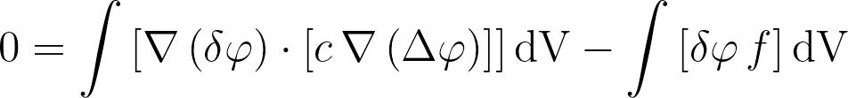

# Table of Contents

- [Concept](#concept)
   - [How is this different from the standard deal.II functionality?](#how-is-this-different-from-the-standard-dealii-functionality) 
   - [How does this work?](#how-does-this-work)
   - [What exactly is the compiler doing?](#what-exactly-is-the-compiler-doing)

# Concept
---------
The idea for this library is to offer an abstraction for the discretisation
of finite element weak forms using the `deal.II` open source finite element
library.

As a preface to what follows, it should be made clear that this library
does not offer any extra "core" functionality to what `deal.II` itself has to
offer. Instead, it hopes to increase the speed and convenience with which one
can implement a finite element problem in `deal.II` -- essentially, facilitating
rapid prototyping and, perhaps, verification of correctness of implementation.
Any *potential* performance improvements are an added benefit. In the end, the
most high-performance code would likely need to hand-written and tailor made
to a specific application.

What does "abstraction of FE discretisation" mean? Well, instead of writing an
assembly loop to assemble into a matrix and vector
```c++
const double coefficient = 1.0;
const double f           = 1.0;

...
for (const auto &cell : dof_handler.active_cell_iterators())
{
  ...
  // Initialise some data structures, precompute some data for use in
  // the assembly loop, ...

  ...
  for (const unsigned int i : fe_values.dof_indices())
  {
    for (const unsigned int j : fe_values.dof_indices())
      cell_matrix(i, j) +=
                (coefficient *                      // a(x_q)
                 fe_values.shape_grad(i, q_index) * // grad phi_i(x_q)
                 fe_values.shape_grad(j, q_index) * // grad phi_j(x_q)
                 fe_values.JxW(q_index));

    cell_rhs(i) += (f *                                 // f(x)
                    fe_values.shape_value(i, q_index) * // phi_i(x_q)
                    fe_values.JxW(q_index));            // dx
  }

  constraints.distribute_local_to_global(cell_matrix,
                                         cell_rhs,
                                         local_dof_indices,
                                         system_matrix,
                                         system_rhs);
}
```
with this library you can do it expressively without having to worry about
the structure of the assembly loop, data initialisation or extraction, and
some of the other details
```c++
  const TestFunction<dim>  test;
  const TrialSolution<dim> trial;
  const ScalarFunctor      mat_coeff("coefficient", "c");
  const ScalarFunctor      rhs_coeff("f", "f");

  const auto mat_coeff_func = mat_coeff.template value<double, dim, spacedim>(
    [](const FEValuesBase<dim, spacedim> &, const unsigned int)
    { return 1.0; });
  const auto rhs_coeff_func = rhs_coeff.template value<double, dim, spacedim>(
    [](const FEValuesBase<dim, spacedim> &, const unsigned int)
    { return 1.0; });

  MatrixBasedAssembler<dim> assembler;

  // LHS contribution: a(grad phi_i, c, grad phi_j)
  assembler += bilinear_form(test.gradient(), 
                             mat_coeff_func,
                             trial.gradient()).dV();
  // RHS contribution: a(phi_i, f)    
  assembler -= linear_form(test.value(), rhs_coeff_func).dV();

  // Take the generic forms, and perform some concrete
  // computations using the given data structures.
  assembler.assemble_system(system_matrix,
                            system_rhs,
                            constraints,
                            dof_handler,
                            qf_cell);
```

If analysing code to debug is a chore, then this library can also spell out,
mathematically, what its going to compute:
- in ACSII format
  ```c++
  const SymbolicDecorations decorator;
  std::cout << assembler.as_ascii(decorator) << std::endl;
  ```
  renders in the output
  ```
  0 = #(Grad(d{U}), coefficient, Grad(D{U}))#dV - #(d{U}, f)#dV
  ```
- or in LaTeX format that can be readily 
  [rendered online](https://arachnoid.com/latex/?equ=0%20%3D%20%5Cint%5Cleft%5B%5Cnabla%5Cleft(%5Cdelta%7B%5Cvarphi%7D%5Cright)%20%5Ccdot%20%5Cleft%5B%7Bc%7D%5C%2C%5Cnabla%5Cleft(%5CDelta%7B%5Cvarphi%7D%5Cright)%5Cright%5D%5Cright%5D%5Ctextrm%7BdV%7D%20%0A-%20%5Cint%5Cleft%5B%5Cdelta%7B%5Cvarphi%7D%5C%2C%7Bf%7D%5Cright%5D%5Ctextrm%7BdV%7D%0A)
  or using a minimal number of added packages
  
  ```c++
  const SymbolicDecorations decorator;
  std::cout << assembler.as_latex(decorator) << std::endl;
  ```
  renders in the output
  ```latex
  0 = \int\left[\nabla\left(\delta{\varphi}\right) \cdot \left[{c}\,\nabla\left(\Delta{\varphi}\right)\right]\right]\textrm{dV} 
  - \int\left[\delta{\varphi}\,{f}\right]\textrm{dV}
  ```

## How is this different from the standard deal.II functionality?

Let's identify the key differences between these two paradigms:
- `native deal.II` (considering the approach typically advocated and
  adopted for "matrix-based" methods): 
  
   When writing an assembly loop, one "sees" the weak form at the lowest level,
   i.e. the fully discretised, indexed entries for each shape function from
   the test space and trial solution spaces, as well as field solutions computed
   at quadrature points and the like. One has to know the discretisation
   (i.e. the assembly function has to have access to a specific `DofHandler`,
   `FiniteElement`, `SparseMatrix`, right-hand-side `Vector`, etc) as context.
   Indeed, such assembly functions can be made generic, but this must be
   done by the implementer at some effort -- only something that advanced
   users of the `deal.II` library might consider doing. This also means that
   the assembly functions might need addition arguments, which might 
   complicate the extension of multi-physics frameworks that use polymorphism
   as part of their design abstraction. None of these (potential) issues are
   insurmountable; they only make the life of the programmer a little more
   challenging.

   When extending or modifying the weak form, the user might have to employ
   some effort to cache data (e.g. when using the `Function` classes).
   The speed and correctness of implementation of an assembly loop are 
   subject to the implementer's skill and expertise. It is difficult
   to write an assembly loop that is both readable and highly performance
   orientated. The naive, explicit assembly algorithm becomes even more
   "interesting" when interface terms are introduced, and mesh adaptivity
   makes things even more tricky. The `MeshWorker::mesh_loop()` concept
   partnered with the `MeshWorker::ScratchData` and `GeneralDataStorage`
   classes can offer a lot of assistance and greatly simplify things here,
   but their use still adds complexity to (and increases the code length of) 
   the assembly method.

   On the matter of correctness, subtle errors related to indexing in the
   assembly loops can be introduced very easily, and sometimes take some
   time to spot. Adding more complexity to the weak form being implemented
   introduces more opportunity for mistakes. Compounding this are the
   formulation of quantities derived from (nonlinear or otherwise complex)
   constitutive laws, and the subsequent consistent linearisation of those
   quantities. To assist in this regard, the automatic and symbolic
   differentiation capabilities built into `deal.II` might be useful, but are
   another aspect of the library that the user must become very familiar with
   before they can use them *correctly* and *effectively*.

- `Symbolic weak form library`:
  
   In contrast, the `weak form` library allows one to write the weak form
   symbolically at a high level. Although only a matter of opinion, perhaps this
   is more expressive than the alternative, as it may be closer to the (bi)linear
   notation that one might find in an academic paper. The notion of "assembly"
   is taken care by the library, and only when requested. Each of the forms that
   are (compile-time) generated are, in fact, patterns for assembly (also known
   as integration kernels), and while these kernels describe how to perform the
   numerical computations, they simultaneously retain some text representation
   of their action. So, if you like, you don't even need to do any assembly
   -- you could use this library, sans `Triangulation` or any other complexity,
   to first to assess an implementation though ASCII or LaTeX output before
   doing anything computational with it. Or, if you have two formulations that
   are identical save for a few terms, then perhaps you could implement the
   one and then later add those few extra bilinear/linear forms to fully
   implement the second formulation (as you would if you passed a matrix-vector
   system through two assembly functions). 

   When you do pass the `assembler` some concrete classes to invoke assembly,
   it's action depends on the information passed to it. One `assembler` could
   form the full linear system, or just the system matrix or RHS vector.
   Do you want to assemble using a different `DoFHandler`? No problem -- the
   `assembler`, which has the patterns for assembly of the generic weak form
   that it encapsulates, just repeats the actions with different input data.
   At the end of the day, this part of the library provides "syntactic sugar"
   (i.e. convenience) to the concept of linear system assembly and its
   generalisation. 

   Modifying a weak form in this library might take a few lines less than
   `deal.II` itself, and whatever you do remains a generalisation due to the
   patterning concept. All data structure initialisation and data caching
   is performed on your behalf, so one doesn't need to think about how to
   extract data from the `deal.II` classes and data structures; this is done
   for you *on demand* (lazily), and never unnecessarily.

   The core of the assembly process has been rigourously tested for
   correctness -- the worst thing that a library like this can do is take away
   the low-level functionality from a user and then introduce a bug that
   invalidates the entire thing that the library is designed to do.
   Although no library is bug-free, it is the author's hope that users of this
   work find it to reliably compute what the user has prescribed.
   Every effort has been made to ensure that the computed linear system and
   processed data is correct but, in the end, there are no guarantees.

   As an implementational detail, an assembly loop is (currently) performed
   for each bilinear and linear form individually. This is not ideal when
   their are multiple forms contributing to the linear system. However,
   as the implementation of the assembly process is opaque to the user,
   the library is able to perform several optimisations to limit the extent
   to which this impacts the overall assembly time. The vectorisation capabilities
   of modern computers can be exploited to do `SIMD` parallelisation on top
   of the multi-threading which is built in to `deal.II`'s `MeshWorker::mesh_loop()`
   concept (and whatever distributed computation the user might be doing using 
   `MPI`). For the classes that are not parallel-friendly, their data is
   extracted as early as possible into parallel data structures, to that
   parallelisation can be used in as many operations as possible. Using
   `MeshWorker::mesh_loop()` means that we can offer (some) functionality for
   DG finite elements and other methods that introduce interface terms.

   On the matter of supporting complex physics models, this library offers
   a *further* abstraction to the automatic and symbolic differentiation
   capabilities of `deal.II`. Due to the symbolic nature of this library,
   special `energy_functional` and `residual_view` forms have been implemented
   that are *self linearising*; that is to say, that they understand their
   parameterisation and can generate new forms that encapsulate the linearisation
   of the residual, or the generation of that residual in the first place.
   The use of `AD` or `SD` is then restricted to quadrature-point level
   calculations, which is the point at which they are most efficiently employed.
   The hope is that the current abstraction to `AD` or `SD` allows the user to
   implement some complex constitutive laws without getting to understand all
   of the details of those frameworks.

   Some other interesting features of the library include the mimicry of `deal.II`
   functions for scalars and tensors, so that this library can be most naturally
   used by people who are familiar with the syntax of the `deal.II` linear
   algebra classes. By means of an example, this would be a valid (albeit 
   non-sensical) bilinear form:
   ```c++
    const TestFunction<dim>          test;
    const TrialSolution<dim>         trial;
    const FieldSolution<dim>         field_solution;
    const SubSpaceExtractors::Vector subspace_extractor_v(0,
                                                          "v",
                                                          "\\mathbf{v}");
    const SubSpaceExtractors::Scalar subspace_extractor_p(dim,
                                                          "p_tilde",
                                                          "\\tilde{p}");

    const auto div_test_v   = test[subspace_extractor_v].divergence();
    const auto grad_trial_p = trial[subspace_extractor_p].gradient();
    const auto v            = field_solution[subspace_extractor_v].value();
    const auto grad_v       = field_solution[subspace_extractor_v].gradient();
    const auto hessian_p    = field_solution[subspace_extractor_p].hessian();

    const auto I = dealii::unit_symmetric_tensor<dim>();

    const auto form = 2.0 * bilinear_form(div_test_v * I,            // rank-2
                                          outer_product(v,grad_v),   // rank-3
                                          hessian_p * grad_trial_p); // rank-1
   ```
   
   Note that in the (terrible) example above, we generated the form without
   specifying the integration domain -- these two actions are orthogonal,
   and one form can be integrated in multiple contexts.
   Naturally, integrals can be restricted to specific subdomains,
   boundaries or interfaces. There is a class that wraps solution histories (even
   those tied to other `DoFHandler`s) so, as examples, time discretisation of
   rate-dependent problems is supported, and the solution of one finite
   element problem can be used as the input to another. More features of the
   library are loosely listed [here](classes.md).

## How does this work?

The design paradigm adopted to implement this library is called expression
templating. The library provides some key elements for which their purpose
(or, in this case, action) is well defined. When these elements are used as
part of a composite operation then, assuming the operation is well defined,
the compiler will generate a new class type that is specifically constructed
to perform the desired operation on or between the input elements. Since the
library cannot predict the generated class type (and this is something that
the user should not really be interested in), the `auto` type deduction keyword
is extensively used where these symbolic operators are returned.

Examples of the core elements would be test functions, trial solutions, field
solutions (denoting the values or derivatives of the finite element solution),
so called "views" of the aforementioned types, as well as scalar or tensor
constants, user-defined functions, and the like. Associated with each of these
is a native data type for mathematical construct that it represents. For instance,
the *gradient* of a *vector view* of a *test function* will be a tensor of
rank 2 -- this "result type" is embedded into the generated class.

Composite expressions of these fundamental elements can be formed using many 
standard scalar and tensor mathematical operations. These take the form of
unary and binary operations; each time such an operation is required, a bespoke
class type that understands the *action* of the operation based on the supplied
input operators (acting as an argument or arguments to the function) is
generated by the compiler based on the input arguments (which, themselves may
by composite expressions). The collection of expressions may then be consumed
by a `linear_form()` or a `bilinear_form()`. Linear forms take a test
function (or a composite operation involving a test function) as its first
argument, and another expression as its second argument. Similarly, bilinear
forms take (composite) test function expressions as their first argument, a
general expression as the second argument, and a (composite) trial solution
expression as their third argument. The library checks the type and rank of
object that each expression returns, and ensures that it is compatible with
the desired action. For instance, the two arguments to a linear form (and, 
similarly, all three arguments to a bilinear form) must contract to a scalar
valued result. After that, integration domain for the form is specified and
this provides all of the information required for assembly of the form.

During assembly, the assembler uses the integration domain to understand which
cells or faces to perform evaluation on. On the relevant subset of cells or
faces, it then calls the user-defined operators (e.g. a composite test function)
with some common input arguments. The composition of expressions, also known as
an [*expression tree*](https://en.wikipedia.org/wiki/Binary_expression_tree), 
is then traversed with the output of the leaves acting as input arguments to
the composition (unary and binary math) operators. What results are the various
terms, defined per quadrature point or per DoF index and quadrature point, that
must be contracted to add to the local cell matrix or RHS vector.

## What exactly is the compiler doing?

As was stated previously, the user is not really supposed to be interested in
what the compiler is generating. It is opaque by nature of the programming
paradigm, but this also makes understanding any compile-time error messages
incredibly difficult. So this warrants a brief explanation of the generated
data structures.

The fundamental, human-readable classes implemented in this library include
(but are not limited to):
- `TestFunction`, `TrialSolution`, `FieldSolution`: 
  All relate to finite element fields.
- `SubSpaceExtractors::Scalar`, `SubSpaceExtractors::Vector`,
  `SubSpaceExtractors::Tensor`, `SubSpaceExtractors::SymmetricTensor`:
  Provide a mechanism to produce a *view* of a multi-component finite elemnt
  field.
- `SubSpaceViews::Scalar`, `SubSpaceViews::Vector`, `SubSpaceViews::Tensor`, 
  `SubSpaceViews::SymmetricTensor`:
  Interpret a subset of the finite element field components as a scalar, vector,
  tensor or symmetric tensor type. This permits additional operations being
  performed on the view (e.g. computing the divergence of a vector field is
  permitted, but not a scalar field).
- `ScalarFunctor`, `TensorFunctor`, `SymmetricTensorFunctor`: 
  Are to return a scalar, tensor, or symmetric tensor at a given point in space.
- `LinearForm` and `BiinearForm`: 
  Collect the test function and a per quadrature-point defined functor (and,
  if necessary, the trial solution) that are to be contracted and integrated.

(In the supplied benchmarks and tests, you will see these classes being 
explicitly typed.)

The main (opaque) data classes that this library uses are:
- `SymbolicOp`: Provides a call operator, and gives a meaning or definition
  to some fundamental operation. These act as the *leaves* of the *expression
  tree* that defines any composite operation.
- `UnaryOp`: Implements a mathematical operation by providing a call operator
  which transforms a single input argument to a single result. 
- `BinaryOp`: Implements a mathematical operation by providing a call operator
  which transforms two input arguments to a single result.  

These three symbolic classes perform the data extraction or transformation based
on their input arguments. As the input arguments are arbitrarily complex, the
generated class has a (template-derived) definition that is similarly arbitrary
complex.

As an illustration of something more concrete, consider the following example:
```c++
const ScalarFunctor              sclr("s", "s");
const TestFunction<dim>          test;
const SubSpaceExtractors::Vector subspace_extractor_v(0,
                                                      "v",
                                                      "\\mathbf{v}");

const auto s           = sclr.template value<double, dim, spacedim>(
  [](const FEValuesBase<dim, spacedim> &, const unsigned int)
  { return 2.0; });                                                   // (1)
const auto grad_test_v = test[subspace_extractor_v].gradient();       // (2)

const auto neg_grad_test_v = -grad_test_v;                            // (3)
const auto s_times_neg_grad_test_v = s * neg_grad_test_v;             // (4)
```
The variables `test` and `sclr` are classes that can be used to generate
some *leaf* symbolic operators. The first two of the enumerated auto-deduced
class types are just such operators. The latter two are the result of a unary
operation and a binary operation. 

Omitting some (well, actually a lot) of the details for the sake of brevity,
these compile to:
1. A (constant) scalar functor that returns the value `2.0` everywhere is a
   ```c++
   SymbolicOp<ScalarFunctor,
              SymbolicOpCodes::value>
   ```
   Shown here, the class signature is somewhat indicatative of the fact that
   it represents the `value` of a `ScalarFunctor`.
2. The gradient of a vector-valued test function is a 
   ```c++
   SymbolicOp<SubSpaceViews::Vector<TestFunction>,
              SymbolicOpCodes::gradient>
   ```
   which again somewhat transparently denotes that it represents the `gradient`
    of a `Vector` subspace view of a `TestFunction`.
1. The negation of the gradient of a vector-valued test function is a
   ```c++
   UnaryOp<SymbolicOp<SubSpaceViews::Vector<TestFunction>, 
                      SymbolicOpCodes::gradient>,
           UnaryOpCodes::negate>
   ```
   Composition complicates things slightly. Read from the outside in, this class
   is a unary operation that `negates` an argument; that argument is the object of
   the type described by point `(2)`.
2. Multiplication of the constant scalar function with the negative gradient
   of a vector-valued test function results in a
   ```c++
   BinaryOp<SymbolicOp<ScalarFunctor, SymbolicOpCodes::value>, 
            UnaryOp<SymbolicOp<SubSpaceViews::Vector<TestFunction>, 
                               SymbolicOpCodes::gradient>, 
                    UnaryOpCodes::negate>, 
            BinaryOpCodes::multiply>
   ```
   Again read from the outside in, this is a binary operation that `multiply`s
   two arguments. The first argument is the same type described in point `(1)`,
   while the second argument is the type described by point `(3)`.

Unfortunately, the concrete class types get more and more complex as the chain
of operations increases. (You might be exposed to this in the event of a
compilation failure in a user code.) However, as the compiler knows the exact
ctype that omputes operations, the call operators are transparent and the
compiler is in principle able to generate very fast code with which to perform
evaluations.