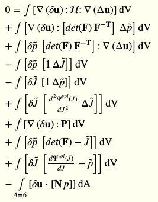
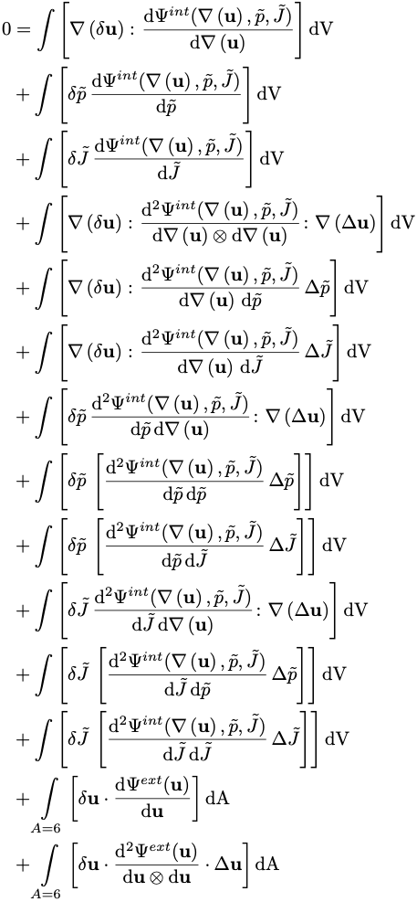

# Examples

Summary
- step-6: Scalar-valued problem
- step-8: Vector-valued problem
- step-44: Multi-field problem
  - Solid mechanics (mixed formulation)
  - Volume and boundary integrals
- step-57:
  - Fluid mechanics (Incompressible stationary Navier-Stokes equations)
  - Nonlinear term
- step-72:
  - A nonlinear elliptic problem (the minimal surface equation)
  - Field-dependent material coefficient (and trial solution in bilinear form)
- [TODO] step-12: DG
- [TODO] step-47: DG
- [TODO] step-74: DG

## Step-44

### Example 1: Standard implementation
ASCII output
```
0 = #(Grad(d{u}), <<<<HH>>>>, Grad(D{u}))#dV 
+ #(Grad(d{u}), [det_F * <<F_inv_T>>], D{p_tilde})#dV 
+ #(d{p_tilde}, [det_F * <<F_inv_T>>], Grad(D{u}))#dV 
- #(d{p_tilde}, 1, D{J_tilde})#dV 
- #(d{J_tilde}, 1, D{p_tilde})#dV 
+ #(d{J_tilde}, d2Psi_vol_dJ2, D{J_tilde})#dV 
+ #(Grad(d{u}), <<P>>)#dV 
+ #(d{p_tilde}, [det_F - {J_tilde}])#dV 
+ #(d{J_tilde}, [dPsi_vol_dJ - {p_tilde}])#dV 
- #(d{u}, [N * p])#dA(A=6)
```

LaTeX output
```
0 = \int\left[\nabla\left(\delta{\mathbf{u}}\right) \colon \mathcal{\mathcal{H}} \colon \nabla\left(\Delta{\mathbf{u}}\right)\right]\textrm{dV} 
+ \int\left[\nabla\left(\delta{\mathbf{u}}\right) \colon \left[{det(\mathbf{F})}\,\mathbf{\mathbf{F}^{-T}}\right]\,\Delta{\tilde{p}}\right]\textrm{dV} 
+ \int\left[\delta{\tilde{p}}\,\left[{det(\mathbf{F})}\,\mathbf{\mathbf{F}^{-T}}\right] \colon \nabla\left(\Delta{\mathbf{u}}\right)\right]\textrm{dV} 
- \int\left[\delta{\tilde{p}}\,\left[{1}\,\Delta{\tilde{J}}\right]\right]\textrm{dV} 
- \int\left[\delta{\tilde{J}}\,\left[{1}\,\Delta{\tilde{p}}\right]\right]\textrm{dV} 
+ \int\left[\delta{\tilde{J}}\,\left[{\frac{d^{2} \Psi^{vol}(J)}{dJ^{2}}}\,\Delta{\tilde{J}}\right]\right]\textrm{dV} 
+ \int\left[\nabla\left(\delta{\mathbf{u}}\right) \colon \mathbf{\mathbf{P}}\right]\textrm{dV} 
+ \int\left[\delta{\tilde{p}}\,\left[{det(\mathbf{F})} 
- {\tilde{J}}\right]\right]\textrm{dV} 
+ \int\left[\delta{\tilde{J}}\,\left[{\frac{d \Psi^{vol}(J)}{dJ}} - {\tilde{p}}\right]\right]\textrm{dV} 
- \int\limits_{A=6}\left[\delta{\mathbf{u}} \cdot \left[\mathbf{N}\,{p}\right]\right]\textrm{dA}
```



### Example 2: Self-linearising energy functional
ASCII output
```
0 = #(Grad(d{u}), d(e^{int}(Grad({u}), {p_tilde}, {J_tilde}))/dGrad({u}))#dV 
+ #(d{p_tilde}, d(e^{int}(Grad({u}), {p_tilde}, {J_tilde}))/d{p_tilde})#dV 
+ #(d{J_tilde}, d(e^{int}(Grad({u}), {p_tilde}, {J_tilde}))/d{J_tilde})#dV 
+ #(Grad(d{u}), d2(e^{int}(Grad({u}), {p_tilde}, {J_tilde}))/(dGrad({u}) x dGrad({u})), Grad(D{u}))#dV 
+ #(Grad(d{u}), d2(e^{int}(Grad({u}), {p_tilde}, {J_tilde}))/(dGrad({u}) d{p_tilde}), D{p_tilde})#dV 
+ #(Grad(d{u}), d2(e^{int}(Grad({u}), {p_tilde}, {J_tilde}))/(dGrad({u}) d{J_tilde}), D{J_tilde})#dV 
+ #(d{p_tilde}, d2(e^{int}(Grad({u}), {p_tilde}, {J_tilde}))/(d{p_tilde} dGrad({u})), Grad(D{u}))#dV 
+ #(d{p_tilde}, d2(e^{int}(Grad({u}), {p_tilde}, {J_tilde}))/(d{p_tilde} d{p_tilde}), D{p_tilde})#dV 
+ #(d{p_tilde}, d2(e^{int}(Grad({u}), {p_tilde}, {J_tilde}))/(d{p_tilde} d{J_tilde}), D{J_tilde})#dV 
+ #(d{J_tilde}, d2(e^{int}(Grad({u}), {p_tilde}, {J_tilde}))/(d{J_tilde} dGrad({u})), Grad(D{u}))#dV 
+ #(d{J_tilde}, d2(e^{int}(Grad({u}), {p_tilde}, {J_tilde}))/(d{J_tilde} d{p_tilde}), D{p_tilde})#dV 
+ #(d{J_tilde}, d2(e^{int}(Grad({u}), {p_tilde}, {J_tilde}))/(d{J_tilde} d{J_tilde}), D{J_tilde})#dV 
+ #(d{u}, d(e^{ext}({u}))/d{u})#dA(A=6) 
+ #(d{u}, d2(e^{ext}({u}))/(d{u} x d{u}), D{u})#dA(A=6)
```

LaTeX output
```
0 = \int\left[\nabla\left(\delta{\mathbf{u}}\right) \colon \frac{\mathrm{d}{\Psi^{int}}(\nabla\left({\mathbf{u}}\right), {\tilde{p}}, {\tilde{J}})}{\mathrm{d}\nabla\left({\mathbf{u}}\right)}\right]\textrm{dV} 
+ \int\left[\delta{\tilde{p}}\,\frac{\mathrm{d}{\Psi^{int}}(\nabla\left({\mathbf{u}}\right), {\tilde{p}}, {\tilde{J}})}{\mathrm{d}{\tilde{p}}}\right]\textrm{dV} 
+ \int\left[\delta{\tilde{J}}\,\frac{\mathrm{d}{\Psi^{int}}(\nabla\left({\mathbf{u}}\right), {\tilde{p}}, {\tilde{J}})}{\mathrm{d}{\tilde{J}}}\right]\textrm{dV} 
+ \int\left[\nabla\left(\delta{\mathbf{u}}\right) \colon \frac{\mathrm{d}^{2}{\Psi^{int}}(\nabla\left({\mathbf{u}}\right), {\tilde{p}}, {\tilde{J}})}{\mathrm{d}\nabla\left({\mathbf{u}}\right) \otimes \mathrm{d}\nabla\left({\mathbf{u}}\right)} \colon \nabla\left(\Delta{\mathbf{u}}\right)\right]\textrm{dV} 
+ \int\left[\nabla\left(\delta{\mathbf{u}}\right) \colon \frac{\mathrm{d}^{2}{\Psi^{int}}(\nabla\left({\mathbf{u}}\right), {\tilde{p}}, {\tilde{J}})}{\mathrm{d}\nabla\left({\mathbf{u}}\right) \, \mathrm{d}{\tilde{p}}}\,\Delta{\tilde{p}}\right]\textrm{dV} 
+ \int\left[\nabla\left(\delta{\mathbf{u}}\right) \colon \frac{\mathrm{d}^{2}{\Psi^{int}}(\nabla\left({\mathbf{u}}\right), {\tilde{p}}, {\tilde{J}})}{\mathrm{d}\nabla\left({\mathbf{u}}\right) \, \mathrm{d}{\tilde{J}}}\,\Delta{\tilde{J}}\right]\textrm{dV} 
+ \int\left[\delta{\tilde{p}}\,\frac{\mathrm{d}^{2}{\Psi^{int}}(\nabla\left({\mathbf{u}}\right), {\tilde{p}}, {\tilde{J}})}{\mathrm{d}{\tilde{p}} \, \mathrm{d}\nabla\left({\mathbf{u}}\right)} \colon \nabla\left(\Delta{\mathbf{u}}\right)\right]\textrm{dV} 
+ \int\left[\delta{\tilde{p}}\,\left[\frac{\mathrm{d}^{2}{\Psi^{int}}(\nabla\left({\mathbf{u}}\right), {\tilde{p}}, {\tilde{J}})}{\mathrm{d}{\tilde{p}} \, \mathrm{d}{\tilde{p}}}\,\Delta{\tilde{p}}\right]\right]\textrm{dV} 
+ \int\left[\delta{\tilde{p}}\,\left[\frac{\mathrm{d}^{2}{\Psi^{int}}(\nabla\left({\mathbf{u}}\right), {\tilde{p}}, {\tilde{J}})}{\mathrm{d}{\tilde{p}} \, \mathrm{d}{\tilde{J}}}\,\Delta{\tilde{J}}\right]\right]\textrm{dV} 
+ \int\left[\delta{\tilde{J}}\,\frac{\mathrm{d}^{2}{\Psi^{int}}(\nabla\left({\mathbf{u}}\right), {\tilde{p}}, {\tilde{J}})}{\mathrm{d}{\tilde{J}} \, \mathrm{d}\nabla\left({\mathbf{u}}\right)} \colon \nabla\left(\Delta{\mathbf{u}}\right)\right]\textrm{dV} 
+ \int\left[\delta{\tilde{J}}\,\left[\frac{\mathrm{d}^{2}{\Psi^{int}}(\nabla\left({\mathbf{u}}\right), {\tilde{p}}, {\tilde{J}})}{\mathrm{d}{\tilde{J}} \, \mathrm{d}{\tilde{p}}}\,\Delta{\tilde{p}}\right]\right]\textrm{dV} 
+ \int\left[\delta{\tilde{J}}\,\left[\frac{\mathrm{d}^{2}{\Psi^{int}}(\nabla\left({\mathbf{u}}\right), {\tilde{p}}, {\tilde{J}})}{\mathrm{d}{\tilde{J}} \, \mathrm{d}{\tilde{J}}}\,\Delta{\tilde{J}}\right]\right]\textrm{dV} 
+ \int\limits_{A=6}\left[\delta{\mathbf{u}} \cdot \frac{\mathrm{d}{\Psi^{ext}}({\mathbf{u}})}{\mathrm{d}{\mathbf{u}}}\right]\textrm{dA} 
+ \int\limits_{A=6}\left[\delta{\mathbf{u}} \cdot \frac{\mathrm{d}^{2}{\Psi^{ext}}({\mathbf{u}})}{\mathrm{d}{\mathbf{u}} \otimes \mathrm{d}{\mathbf{u}}} \cdot \Delta{\mathbf{u}}\right]\textrm{dA}
```




### Example 3: Self-linearising residual form
ASCII output
```
0 = #(Grad(d{u}), <R>_[Grad(d{u})](Grad({u}), {p_tilde}))#dV 
+ #(Grad(d{u}), d(<R>_[Grad(d{u})](Grad({u}), {p_tilde}))/dGrad({u}), Grad(D{u}))#dV 
+ #(Grad(d{u}), d(<R>_[Grad(d{u})](Grad({u}), {p_tilde}))/d{p_tilde}, D{p_tilde})#dV 
+ #(d{p_tilde}, <R>_[d{p_tilde}](Grad({u}), {J_tilde}))#dV 
+ #(d{p_tilde}, d(<R>_[d{p_tilde}](Grad({u}), {J_tilde}))/dGrad({u}), Grad(D{u}))#dV 
+ #(d{p_tilde}, d(<R>_[d{p_tilde}](Grad({u}), {J_tilde}))/d{J_tilde}, D{J_tilde})#dV 
+ #(d{J_tilde}, <R>_[d{J_tilde}]({p_tilde}, {J_tilde}))#dV 
+ #(d{J_tilde}, d(<R>_[d{J_tilde}]({p_tilde}, {J_tilde}))/d{p_tilde}, D{p_tilde})#dV 
+ #(d{J_tilde}, d(<R>_[d{J_tilde}]({p_tilde}, {J_tilde}))/d{J_tilde}, D{J_tilde})#dV 
- #(d{u}, <F>_[d{u}]({u}))#dA(A=6) 
- #(d{u}, d(<F>_[d{u}]({u}))/d{u}, D{u})#dA(A=6)

```

LaTeX output
```
0 = \int\left[\nabla\left(\delta{\mathbf{u}}\right) \colon {\mathrm{R}}_{\nabla\left(\delta{\mathbf{u}}\right)}\left(\nabla\left({\mathbf{u}}\right), {\tilde{p}}\right)\right]\textrm{dV} 
+ \int\left[\nabla\left(\delta{\mathbf{u}}\right) \colon \frac{\mathrm{d}{\mathrm{R}}_{\nabla\left(\delta{\mathbf{u}}\right)}\left(\nabla\left({\mathbf{u}}\right), {\tilde{p}}\right)}{\mathrm{d}\nabla\left({\mathbf{u}}\right)} \colon \nabla\left(\Delta{\mathbf{u}}\right)\right]\textrm{dV} 
+ \int\left[\nabla\left(\delta{\mathbf{u}}\right) \colon \frac{\mathrm{d}{\mathrm{R}}_{\nabla\left(\delta{\mathbf{u}}\right)}\left(\nabla\left({\mathbf{u}}\right), {\tilde{p}}\right)}{\mathrm{d}{\tilde{p}}}\,\Delta{\tilde{p}}\right]\textrm{dV} 
+ \int\left[\delta{\tilde{p}}\,{\mathrm{R}}_{\delta{\tilde{p}}}\left(\nabla\left({\mathbf{u}}\right), {\tilde{J}}\right)\right]\textrm{dV} 
+ \int\left[\delta{\tilde{p}}\,\frac{\mathrm{d}{\mathrm{R}}_{\delta{\tilde{p}}}\left(\nabla\left({\mathbf{u}}\right), {\tilde{J}}\right)}{\mathrm{d}\nabla\left({\mathbf{u}}\right)} \colon \nabla\left(\Delta{\mathbf{u}}\right)\right]\textrm{dV} 
+ \int\left[\delta{\tilde{p}}\,\left[\frac{\mathrm{d}{\mathrm{R}}_{\delta{\tilde{p}}}\left(\nabla\left({\mathbf{u}}\right), {\tilde{J}}\right)}{\mathrm{d}{\tilde{J}}}\,\Delta{\tilde{J}}\right]\right]\textrm{dV} 
+ \int\left[\delta{\tilde{J}}\,{\mathrm{R}}_{\delta{\tilde{J}}}\left({\tilde{p}}, {\tilde{J}}\right)\right]\textrm{dV} 
+ \int\left[\delta{\tilde{J}}\,\left[\frac{\mathrm{d}{\mathrm{R}}_{\delta{\tilde{J}}}\left({\tilde{p}}, {\tilde{J}}\right)}{\mathrm{d}{\tilde{p}}}\,\Delta{\tilde{p}}\right]\right]\textrm{dV} 
+ \int\left[\delta{\tilde{J}}\,\left[\frac{\mathrm{d}{\mathrm{R}}_{\delta{\tilde{J}}}\left({\tilde{p}}, {\tilde{J}}\right)}{\mathrm{d}{\tilde{J}}}\,\Delta{\tilde{J}}\right]\right]\textrm{dV} 
- \int\limits_{A=6}\left[\delta{\mathbf{u}} \cdot {\mathrm{F}}_{\delta{\mathbf{u}}}\left({\mathbf{u}}\right)\right]\textrm{dA} 
- \int\limits_{A=6}\left[\delta{\mathbf{u}} \cdot \frac{\mathrm{d}{\mathrm{F}}_{\delta{\mathbf{u}}}\left({\mathbf{u}}\right)}{\mathrm{d}{\mathbf{u}}} \cdot \Delta{\mathbf{u}}\right]\textrm{dA}

```