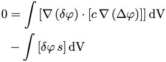
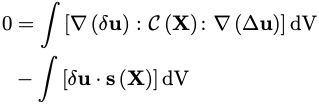
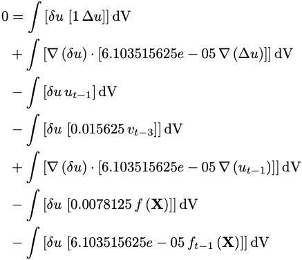
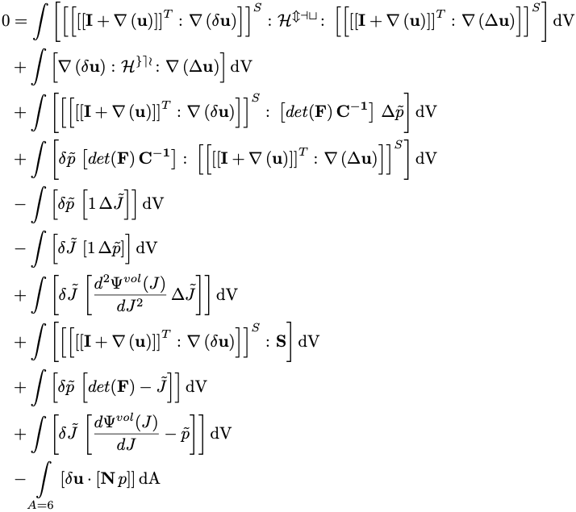
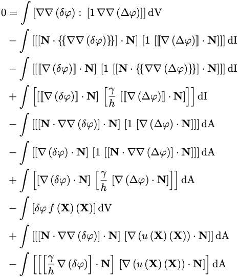
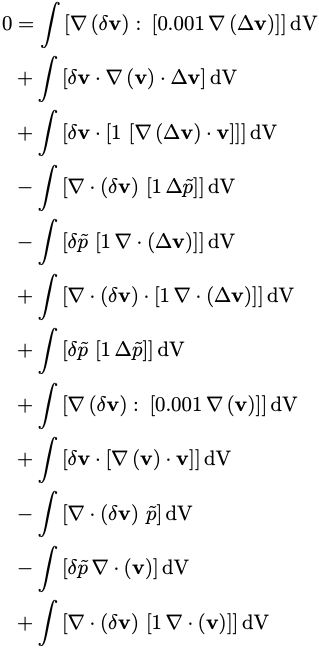
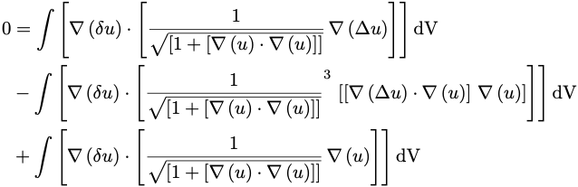
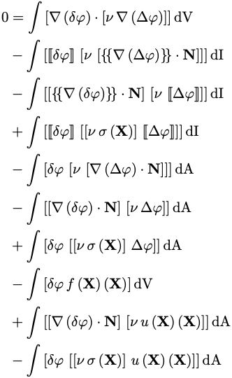

# Examples
----------

## Summary
- step-6:
  - Laplace / Poisson equation 
  - Scalar-valued problem
- step-8:
  - Elasticity equation
  - Vector-valued problem
- step-12:
  - Advection problem
  - Discontinuous Galerkin method  (DG)
  - Only a partial implementation (the conditional in the assembly doesn't lend
    itself well to the weak forms approach)
- step-23:
  - The wave equation
  - Fractional time stepping
- step-44: Multi-field problem
  - Finite-strain solid mechanics (mixed formulation)
  - Volume and boundary integrals
- step-47:
  - Biharmonic problem
  - Discontinuous Galerkin method (DG)
  - Volume, boundary and interface integrals
- step-57:
  - Fluid mechanics (Incompressible stationary Navier-Stokes equations)
  - Nonlinear term
- step-72:
  - A nonlinear elliptic problem (the minimal surface equation)
  - Field-dependent material coefficient (and trial solution in bilinear form)
- step-74:
  - The Symmetric interior penalty Galerkin (SIPG) method for Poisson's equation
  - Discontinuous Galerkin method  (DG)
  - Volume, boundary and interface integrals


## Step-6
---------
ASCII output
```
0 = #(Grad(d{U}), c, Grad(D{U}))#dV 
- #(d{U}, s)#dV
```

LaTeX output
```latex
0 = \int\left[\nabla\left(\delta{\varphi}\right) \cdot \left[{c}\,\nabla\left(\Delta{\varphi}\right)\right]\right]\textrm{dV} 
- \int\left[\delta{\varphi}\,{s}\right]\textrm{dV}
```



## Step-8
---------
ASCII output
```
0 = #(Grad(d{u}), <<<<C(X)>>>>, Grad(D{u}))#dV 
- #(d{u}, <s(X)>)#dV
```

LaTeX output
```latex
0 = \int\left[\nabla\left(\delta{\mathbf{u}}\right) \colon \mathcal{\mathcal{C}\left(\mathbf{X}\right)} \colon \nabla\left(\Delta{\mathbf{u}}\right)\right]\textrm{dV} 
- \int\left[\delta{\mathbf{u}} \cdot \mathrm{\mathbf{s}\left(\mathbf{X}\right)}\right]\textrm{dV}
```



## Step-12
----------
ASCII output
```
0 = #(Grad(d{s}), -<beta(X)>, D{s})#dV
```

LaTeX output
```latex
0 = \int\left[\nabla\left(\delta{\mathbf{s}}\right) \cdot -\mathrm{\beta\left(\mathbf{X}\right)}\,\Delta{\mathbf{s}}\right]\textrm{dV}
```

## Step-23
----------
ASCII output
```
0 = #(d{u}, 1, D{u})#dV 
+ #(Grad(d{u}), 6.103515625e-05, Grad(D{u}))#dV 
- #(d{u}, {u}_1)#dV 
- #(d{u}, [0.015625 * {v}_3])#dV 
+ #(Grad(d{u}), [6.103515625e-05 * Grad({u}_1)])#dV 
- #(d{u}, [0.0078125 * f(X)])#dV 
- #(d{u}, [6.103515625e-05 * f_t1(X)])#dV
```

LaTeX output
```latex
0 = \int\left[\delta{u}\,\left[{1}\,\Delta{u}\right]\right]\textrm{dV} 
+ \int\left[\nabla\left(\delta{u}\right) \cdot \left[{6.103515625e-05}\,\nabla\left(\Delta{u}\right)\right]\right]\textrm{dV} 
- \int\left[\delta{u}\,{u}_{t-1}\right]\textrm{dV} 
- \int\left[\delta{u}\,\left[{0.015625}\,{v}_{t-3}\right]\right]\textrm{dV} 
+ \int\left[\nabla\left(\delta{u}\right) \cdot \left[{6.103515625e-05}\,\nabla\left({u}_{t-1}\right)\right]\right]\textrm{dV} 
- \int\left[\delta{u}\,\left[{0.0078125}\,{f\left(\mathbf{X}\right)}\right]\right]\textrm{dV} 
- \int\left[\delta{u}\,\left[{6.103515625e-05}\,{f_{t-1}\left(\mathbf{X}\right)}\right]\right]\textrm{dV}
```



## Step-44
----------

### Example 1: Standard implementation
ASCII output
```
0 = #(Grad(d{u}), <<<<HH>>>>, Grad(D{u}))#dV 
+ #(Grad(d{u}), [det_F * <<F_inv_T>>], D{p_tilde})#dV 
+ #(d{p_tilde}, [det_F * <<F_inv_T>>], Grad(D{u}))#dV 
- #(d{p_tilde}, 1, D{J_tilde})#dV 
- #(d{J_tilde}, 1, D{p_tilde})#dV 
+ #(d{J_tilde}, d2Psi_vol_dJ2, D{J_tilde})#dV 
+ #(Grad(d{u}), <<P>>)#dV 
+ #(d{p_tilde}, [det_F - {J_tilde}])#dV 
+ #(d{J_tilde}, [dPsi_vol_dJ - {p_tilde}])#dV 
- #(d{u}, [N * p])#dA(A=6)
```

LaTeX output
```latex
0 = \int\left[\nabla\left(\delta{\mathbf{u}}\right) \colon \mathcal{\mathcal{H}} \colon \nabla\left(\Delta{\mathbf{u}}\right)\right]\textrm{dV} 
+ \int\left[\nabla\left(\delta{\mathbf{u}}\right) \colon \left[{det(\mathbf{F})}\,\mathbf{\mathbf{F}^{-T}}\right]\,\Delta{\tilde{p}}\right]\textrm{dV} 
+ \int\left[\delta{\tilde{p}}\,\left[{det(\mathbf{F})}\,\mathbf{\mathbf{F}^{-T}}\right] \colon \nabla\left(\Delta{\mathbf{u}}\right)\right]\textrm{dV} 
- \int\left[\delta{\tilde{p}}\,\left[{1}\,\Delta{\tilde{J}}\right]\right]\textrm{dV} 
- \int\left[\delta{\tilde{J}}\,\left[{1}\,\Delta{\tilde{p}}\right]\right]\textrm{dV} 
+ \int\left[\delta{\tilde{J}}\,\left[{\frac{d^{2} \Psi^{vol}(J)}{dJ^{2}}}\,\Delta{\tilde{J}}\right]\right]\textrm{dV} 
+ \int\left[\nabla\left(\delta{\mathbf{u}}\right) \colon \mathbf{\mathbf{P}}\right]\textrm{dV} 
+ \int\left[\delta{\tilde{p}}\,\left[{det(\mathbf{F})} 
- {\tilde{J}}\right]\right]\textrm{dV} 
+ \int\left[\delta{\tilde{J}}\,\left[{\frac{d \Psi^{vol}(J)}{dJ}} - {\tilde{p}}\right]\right]\textrm{dV} 
- \int\limits_{A=6}\left[\delta{\mathbf{u}} \cdot \left[\mathbf{N}\,{p}\right]\right]\textrm{dA}
```


### Example 2: Self-linearising energy functional
ASCII output
```
0 = #(Grad(d{u}), d(e^{int}(Grad({u}), {p_tilde}, {J_tilde}))/dGrad({u}))#dV 
+ #(d{p_tilde}, d(e^{int}(Grad({u}), {p_tilde}, {J_tilde}))/d{p_tilde})#dV 
+ #(d{J_tilde}, d(e^{int}(Grad({u}), {p_tilde}, {J_tilde}))/d{J_tilde})#dV 
+ #(Grad(d{u}), d2(e^{int}(Grad({u}), {p_tilde}, {J_tilde}))/(dGrad({u}) x dGrad({u})), Grad(D{u}))#dV 
+ #(Grad(d{u}), d2(e^{int}(Grad({u}), {p_tilde}, {J_tilde}))/(dGrad({u}) d{p_tilde}), D{p_tilde})#dV 
+ #(Grad(d{u}), d2(e^{int}(Grad({u}), {p_tilde}, {J_tilde}))/(dGrad({u}) d{J_tilde}), D{J_tilde})#dV 
+ #(d{p_tilde}, d2(e^{int}(Grad({u}), {p_tilde}, {J_tilde}))/(d{p_tilde} dGrad({u})), Grad(D{u}))#dV 
+ #(d{p_tilde}, d2(e^{int}(Grad({u}), {p_tilde}, {J_tilde}))/(d{p_tilde} d{p_tilde}), D{p_tilde})#dV 
+ #(d{p_tilde}, d2(e^{int}(Grad({u}), {p_tilde}, {J_tilde}))/(d{p_tilde} d{J_tilde}), D{J_tilde})#dV 
+ #(d{J_tilde}, d2(e^{int}(Grad({u}), {p_tilde}, {J_tilde}))/(d{J_tilde} dGrad({u})), Grad(D{u}))#dV 
+ #(d{J_tilde}, d2(e^{int}(Grad({u}), {p_tilde}, {J_tilde}))/(d{J_tilde} d{p_tilde}), D{p_tilde})#dV 
+ #(d{J_tilde}, d2(e^{int}(Grad({u}), {p_tilde}, {J_tilde}))/(d{J_tilde} d{J_tilde}), D{J_tilde})#dV 
+ #(d{u}, d(e^{ext}({u}))/d{u})#dA(A=6) 
+ #(d{u}, d2(e^{ext}({u}))/(d{u} x d{u}), D{u})#dA(A=6)
```

LaTeX output
```latex
0 = \int\left[\nabla\left(\delta{\mathbf{u}}\right) \colon \frac{\mathrm{d}{\Psi^{int}}(\nabla\left({\mathbf{u}}\right), {\tilde{p}}, {\tilde{J}})}{\mathrm{d}\nabla\left({\mathbf{u}}\right)}\right]\textrm{dV} 
+ \int\left[\delta{\tilde{p}}\,\frac{\mathrm{d}{\Psi^{int}}(\nabla\left({\mathbf{u}}\right), {\tilde{p}}, {\tilde{J}})}{\mathrm{d}{\tilde{p}}}\right]\textrm{dV} 
+ \int\left[\delta{\tilde{J}}\,\frac{\mathrm{d}{\Psi^{int}}(\nabla\left({\mathbf{u}}\right), {\tilde{p}}, {\tilde{J}})}{\mathrm{d}{\tilde{J}}}\right]\textrm{dV} 
+ \int\left[\nabla\left(\delta{\mathbf{u}}\right) \colon \frac{\mathrm{d}^{2}{\Psi^{int}}(\nabla\left({\mathbf{u}}\right), {\tilde{p}}, {\tilde{J}})}{\mathrm{d}\nabla\left({\mathbf{u}}\right) \otimes \mathrm{d}\nabla\left({\mathbf{u}}\right)} \colon \nabla\left(\Delta{\mathbf{u}}\right)\right]\textrm{dV} 
+ \int\left[\nabla\left(\delta{\mathbf{u}}\right) \colon \frac{\mathrm{d}^{2}{\Psi^{int}}(\nabla\left({\mathbf{u}}\right), {\tilde{p}}, {\tilde{J}})}{\mathrm{d}\nabla\left({\mathbf{u}}\right) \, \mathrm{d}{\tilde{p}}}\,\Delta{\tilde{p}}\right]\textrm{dV} 
+ \int\left[\nabla\left(\delta{\mathbf{u}}\right) \colon \frac{\mathrm{d}^{2}{\Psi^{int}}(\nabla\left({\mathbf{u}}\right), {\tilde{p}}, {\tilde{J}})}{\mathrm{d}\nabla\left({\mathbf{u}}\right) \, \mathrm{d}{\tilde{J}}}\,\Delta{\tilde{J}}\right]\textrm{dV} 
+ \int\left[\delta{\tilde{p}}\,\frac{\mathrm{d}^{2}{\Psi^{int}}(\nabla\left({\mathbf{u}}\right), {\tilde{p}}, {\tilde{J}})}{\mathrm{d}{\tilde{p}} \, \mathrm{d}\nabla\left({\mathbf{u}}\right)} \colon \nabla\left(\Delta{\mathbf{u}}\right)\right]\textrm{dV} 
+ \int\left[\delta{\tilde{p}}\,\left[\frac{\mathrm{d}^{2}{\Psi^{int}}(\nabla\left({\mathbf{u}}\right), {\tilde{p}}, {\tilde{J}})}{\mathrm{d}{\tilde{p}} \, \mathrm{d}{\tilde{p}}}\,\Delta{\tilde{p}}\right]\right]\textrm{dV} 
+ \int\left[\delta{\tilde{p}}\,\left[\frac{\mathrm{d}^{2}{\Psi^{int}}(\nabla\left({\mathbf{u}}\right), {\tilde{p}}, {\tilde{J}})}{\mathrm{d}{\tilde{p}} \, \mathrm{d}{\tilde{J}}}\,\Delta{\tilde{J}}\right]\right]\textrm{dV} 
+ \int\left[\delta{\tilde{J}}\,\frac{\mathrm{d}^{2}{\Psi^{int}}(\nabla\left({\mathbf{u}}\right), {\tilde{p}}, {\tilde{J}})}{\mathrm{d}{\tilde{J}} \, \mathrm{d}\nabla\left({\mathbf{u}}\right)} \colon \nabla\left(\Delta{\mathbf{u}}\right)\right]\textrm{dV} 
+ \int\left[\delta{\tilde{J}}\,\left[\frac{\mathrm{d}^{2}{\Psi^{int}}(\nabla\left({\mathbf{u}}\right), {\tilde{p}}, {\tilde{J}})}{\mathrm{d}{\tilde{J}} \, \mathrm{d}{\tilde{p}}}\,\Delta{\tilde{p}}\right]\right]\textrm{dV} 
+ \int\left[\delta{\tilde{J}}\,\left[\frac{\mathrm{d}^{2}{\Psi^{int}}(\nabla\left({\mathbf{u}}\right), {\tilde{p}}, {\tilde{J}})}{\mathrm{d}{\tilde{J}} \, \mathrm{d}{\tilde{J}}}\,\Delta{\tilde{J}}\right]\right]\textrm{dV} 
+ \int\limits_{A=6}\left[\delta{\mathbf{u}} \cdot \frac{\mathrm{d}{\Psi^{ext}}({\mathbf{u}})}{\mathrm{d}{\mathbf{u}}}\right]\textrm{dA} 
+ \int\limits_{A=6}\left[\delta{\mathbf{u}} \cdot \frac{\mathrm{d}^{2}{\Psi^{ext}}({\mathbf{u}})}{\mathrm{d}{\mathbf{u}} \otimes \mathrm{d}{\mathbf{u}}} \cdot \Delta{\mathbf{u}}\right]\textrm{dA}
```


### Example 3: Self-linearising residual form
ASCII output
```
0 = #(Grad(d{u}), <R>_[Grad(d{u})](Grad({u}), {p_tilde}))#dV 
+ #(Grad(d{u}), d(<R>_[Grad(d{u})](Grad({u}), {p_tilde}))/dGrad({u}), Grad(D{u}))#dV 
+ #(Grad(d{u}), d(<R>_[Grad(d{u})](Grad({u}), {p_tilde}))/d{p_tilde}, D{p_tilde})#dV 
+ #(d{p_tilde}, <R>_[d{p_tilde}](Grad({u}), {J_tilde}))#dV 
+ #(d{p_tilde}, d(<R>_[d{p_tilde}](Grad({u}), {J_tilde}))/dGrad({u}), Grad(D{u}))#dV 
+ #(d{p_tilde}, d(<R>_[d{p_tilde}](Grad({u}), {J_tilde}))/d{J_tilde}, D{J_tilde})#dV 
+ #(d{J_tilde}, <R>_[d{J_tilde}]({p_tilde}, {J_tilde}))#dV 
+ #(d{J_tilde}, d(<R>_[d{J_tilde}]({p_tilde}, {J_tilde}))/d{p_tilde}, D{p_tilde})#dV 
+ #(d{J_tilde}, d(<R>_[d{J_tilde}]({p_tilde}, {J_tilde}))/d{J_tilde}, D{J_tilde})#dV 
- #(d{u}, <F>_[d{u}]({u}))#dA(A=6) 
- #(d{u}, d(<F>_[d{u}]({u}))/d{u}, D{u})#dA(A=6)
```

LaTeX output
```latex
0 = \int\left[\nabla\left(\delta{\mathbf{u}}\right) \colon {\mathrm{R}}_{\nabla\left(\delta{\mathbf{u}}\right)}\left(\nabla\left({\mathbf{u}}\right), {\tilde{p}}\right)\right]\textrm{dV} 
+ \int\left[\nabla\left(\delta{\mathbf{u}}\right) \colon \frac{\mathrm{d}{\mathrm{R}}_{\nabla\left(\delta{\mathbf{u}}\right)}\left(\nabla\left({\mathbf{u}}\right), {\tilde{p}}\right)}{\mathrm{d}\nabla\left({\mathbf{u}}\right)} \colon \nabla\left(\Delta{\mathbf{u}}\right)\right]\textrm{dV} 
+ \int\left[\nabla\left(\delta{\mathbf{u}}\right) \colon \frac{\mathrm{d}{\mathrm{R}}_{\nabla\left(\delta{\mathbf{u}}\right)}\left(\nabla\left({\mathbf{u}}\right), {\tilde{p}}\right)}{\mathrm{d}{\tilde{p}}}\,\Delta{\tilde{p}}\right]\textrm{dV} 
+ \int\left[\delta{\tilde{p}}\,{\mathrm{R}}_{\delta{\tilde{p}}}\left(\nabla\left({\mathbf{u}}\right), {\tilde{J}}\right)\right]\textrm{dV} 
+ \int\left[\delta{\tilde{p}}\,\frac{\mathrm{d}{\mathrm{R}}_{\delta{\tilde{p}}}\left(\nabla\left({\mathbf{u}}\right), {\tilde{J}}\right)}{\mathrm{d}\nabla\left({\mathbf{u}}\right)} \colon \nabla\left(\Delta{\mathbf{u}}\right)\right]\textrm{dV} 
+ \int\left[\delta{\tilde{p}}\,\left[\frac{\mathrm{d}{\mathrm{R}}_{\delta{\tilde{p}}}\left(\nabla\left({\mathbf{u}}\right), {\tilde{J}}\right)}{\mathrm{d}{\tilde{J}}}\,\Delta{\tilde{J}}\right]\right]\textrm{dV} 
+ \int\left[\delta{\tilde{J}}\,{\mathrm{R}}_{\delta{\tilde{J}}}\left({\tilde{p}}, {\tilde{J}}\right)\right]\textrm{dV} 
+ \int\left[\delta{\tilde{J}}\,\left[\frac{\mathrm{d}{\mathrm{R}}_{\delta{\tilde{J}}}\left({\tilde{p}}, {\tilde{J}}\right)}{\mathrm{d}{\tilde{p}}}\,\Delta{\tilde{p}}\right]\right]\textrm{dV} 
+ \int\left[\delta{\tilde{J}}\,\left[\frac{\mathrm{d}{\mathrm{R}}_{\delta{\tilde{J}}}\left({\tilde{p}}, {\tilde{J}}\right)}{\mathrm{d}{\tilde{J}}}\,\Delta{\tilde{J}}\right]\right]\textrm{dV} 
- \int\limits_{A=6}\left[\delta{\mathbf{u}} \cdot {\mathrm{F}}_{\delta{\mathbf{u}}}\left({\mathbf{u}}\right)\right]\textrm{dA} 
- \int\limits_{A=6}\left[\delta{\mathbf{u}} \cdot \frac{\mathrm{d}{\mathrm{F}}_{\delta{\mathbf{u}}}\left({\mathbf{u}}\right)}{\mathrm{d}{\mathbf{u}}} \cdot \Delta{\mathbf{u}}\right]\textrm{dA}
```



## Step-47
----------
ASCII output
```
0 = #(Hessian(d{U}), 1, Hessian(D{U}))#dV 
- #([[N * {{Hessian(d{U})}}] * N], 1, [[[Grad(D{U})]] * N])#dI 
- #([[[Grad(d{U})]] * N], 1, [[N * {{Hessian(D{U})}}] * N])#dI 
+ #([[[Grad(d{U})]] * N], gamma/h, [[[Grad(D{U})]] * N])#dI 
- #([[N * Hessian(d{U})] * N], 1, [Grad(D{U}) * N])#dA 
- #([Grad(d{U}) * N], 1, [[N * Hessian(D{U})] * N])#dA 
+ #([Grad(d{U}) * N], gamma/h, [Grad(D{U}) * N])#dA 
- #(d{U}, f(x)(X))#dV 
+ #([[N * Hessian(d{U})] * N], [Grad(u(x)(X)) * N])#dA 
- #([[gamma/h * Grad(d{U})] * N], [Grad(u(x)(X)) * N])#dA
```

LaTeX output
```latex
0 = \int\left[\nabla\nabla\left(\delta{\varphi}\right) \colon \left[{1}\,\nabla\nabla\left(\Delta{\varphi}\right)\right]\right]\textrm{dV} 
- \int\left[\left[\left[\mathbf{N} \cdot \left\lbrace\!\left\lbrace\nabla\nabla\left(\delta{\varphi}\right)\right\rbrace\!\right\rbrace\right] \cdot \mathbf{N}\right]\,\left[{1}\,\left[\left[\!\left[\nabla\left(\Delta{\varphi}\right)\right]\!\right] \cdot \mathbf{N}\right]\right]\right]\textrm{dI} 
- \int\left[\left[\left[\!\left[\nabla\left(\delta{\varphi}\right)\right]\!\right] \cdot \mathbf{N}\right]\,\left[{1}\,\left[\left[\mathbf{N} \cdot \left\lbrace\!\left\lbrace\nabla\nabla\left(\Delta{\varphi}\right)\right\rbrace\!\right\rbrace\right] \cdot \mathbf{N}\right]\right]\right]\textrm{dI} 
+ \int\left[\left[\left[\!\left[\nabla\left(\delta{\varphi}\right)\right]\!\right] \cdot \mathbf{N}\right]\,\left[{\frac{\gamma}{h}}\,\left[\left[\!\left[\nabla\left(\Delta{\varphi}\right)\right]\!\right] \cdot \mathbf{N}\right]\right]\right]\textrm{dI} 
- \int\left[\left[\left[\mathbf{N} \cdot \nabla\nabla\left(\delta{\varphi}\right)\right] \cdot \mathbf{N}\right]\,\left[{1}\,\left[\nabla\left(\Delta{\varphi}\right) \cdot \mathbf{N}\right]\right]\right]\textrm{dA} 
- \int\left[\left[\nabla\left(\delta{\varphi}\right) \cdot \mathbf{N}\right]\,\left[{1}\,\left[\left[\mathbf{N} \cdot \nabla\nabla\left(\Delta{\varphi}\right)\right] \cdot \mathbf{N}\right]\right]\right]\textrm{dA} 
+ \int\left[\left[\nabla\left(\delta{\varphi}\right) \cdot \mathbf{N}\right]\,\left[{\frac{\gamma}{h}}\,\left[\nabla\left(\Delta{\varphi}\right) \cdot \mathbf{N}\right]\right]\right]\textrm{dA} 
- \int\left[\delta{\varphi}\,{f\left(\mathbf{X}\right)\left(\mathbf{X}\right)}\right]\textrm{dV} 
+ \int\left[\left[\left[\mathbf{N} \cdot \nabla\nabla\left(\delta{\varphi}\right)\right] \cdot \mathbf{N}\right]\,\left[\nabla\left({u\left(\mathbf{X}\right)\left(\mathbf{X}\right)}\right) \cdot \mathbf{N}\right]\right]\textrm{dA} 
- \int\left[\left[\left[{\frac{\gamma}{h}}\,\nabla\left(\delta{\varphi}\right)\right] \cdot \mathbf{N}\right]\,\left[\nabla\left({u\left(\mathbf{X}\right)\left(\mathbf{X}\right)}\right) \cdot \mathbf{N}\right]\right]\textrm{dA}
```



## Step-57
----------
ASCII output
```
0 = #(Grad(d{v}), 0.001, Grad(D{v}))#dV + #(d{v}, Grad({v}), D{v})#dV 
+ #(d{v}, 1, [Grad(D{v}) * {v}])#dV 
- #(Div(d{v}), 1, D{p_tilde})#dV - #(d{p_tilde}, 1, Div(D{v}))#dV 
+ #(Div(d{v}), 1, Div(D{v}))#dV + #(d{p_tilde}, 1, D{p_tilde})#dV 
+ #(Grad(d{v}), [0.001 * Grad({v})])#dV + #(d{v}, [Grad({v}) * {v}])#dV 
- #(Div(d{v}), {p_tilde})#dV 
- #(d{p_tilde}, Div({v}))#dV + #(Div(d{v}), [1 * Div({v})])#dV
```

LaTeX output
```latex
0 = \int\left[\nabla\left(\delta{\mathbf{v}}\right) \colon \left[{0.001}\,\nabla\left(\Delta{\mathbf{v}}\right)\right]\right]\textrm{dV} 
+ \int\left[\delta{\mathbf{v}} \cdot \nabla\left({\mathbf{v}}\right) \cdot \Delta{\mathbf{v}}\right]\textrm{dV} 
+ \int\left[\delta{\mathbf{v}} \cdot \left[{1}\,\left[\nabla\left(\Delta{\mathbf{v}}\right) \cdot {\mathbf{v}}\right]\right]\right]\textrm{dV} 
- \int\left[\nabla \cdot\left(\delta{\mathbf{v}}\right)\,\left[{1}\,\Delta{\tilde{p}}\right]\right]\textrm{dV} 
- \int\left[\delta{\tilde{p}}\,\left[{1}\,\nabla \cdot\left(\Delta{\mathbf{v}}\right)\right]\right]\textrm{dV} 
+ \int\left[\nabla \cdot\left(\delta{\mathbf{v}}\right) \cdot \left[{1}\,\nabla \cdot\left(\Delta{\mathbf{v}}\right)\right]\right]\textrm{dV} 
+ \int\left[\delta{\tilde{p}}\,\left[{1}\,\Delta{\tilde{p}}\right]\right]\textrm{dV} 
+ \int\left[\nabla\left(\delta{\mathbf{v}}\right) \colon \left[{0.001}\,\nabla\left({\mathbf{v}}\right)\right]\right]\textrm{dV} 
+ \int\left[\delta{\mathbf{v}} \cdot \left[\nabla\left({\mathbf{v}}\right) \cdot {\mathbf{v}}\right]\right]\textrm{dV} 
- \int\left[\nabla \cdot\left(\delta{\mathbf{v}}\right)\,{\tilde{p}}\right]\textrm{dV} 
- \int\left[\delta{\tilde{p}}\,\nabla \cdot\left({\mathbf{v}}\right)\right]\textrm{dV} 
+ \int\left[\nabla \cdot\left(\delta{\mathbf{v}}\right)\,\left[{1}\,\nabla \cdot\left({\mathbf{v}}\right)\right]\right]\textrm{dV}
```



## Step-72
----------
ASCII output
```
0 = #(Grad(d{u}), [1 / sqrt([1 + [Grad({u}) * Grad({u})]])], Grad(D{u}))#dV 
- #(Grad(d{u}), [[1 / sqrt([1 + [Grad({u}) * Grad({u})]])]]^[3], [[Grad(D{u}) * Grad({u})] * Grad({u})])#dV 
+ #(Grad(d{u}), [[1 / sqrt([1 + [Grad({u}) * Grad({u})]])] * Grad({u})])#dV
```

LaTeX output
```latex
0 = \int\left[\nabla\left(\delta{u}\right) \cdot \left[\frac{{1}}{\sqrt{\left[{1} + \left[\nabla\left({u}\right) \cdot \nabla\left({u}\right)\right]\right]}}\,\nabla\left(\Delta{u}\right)\right]\right]\textrm{dV} 
- \int\left[\nabla\left(\delta{u}\right) \cdot \left[{\frac{{1}}{\sqrt{\left[{1} + \left[\nabla\left({u}\right) \cdot \nabla\left({u}\right)\right]\right]}}}^{{3}}\,\left[\left[\nabla\left(\Delta{u}\right) \cdot \nabla\left({u}\right)\right]\,\nabla\left({u}\right)\right]\right]\right]\textrm{dV} 
+ \int\left[\nabla\left(\delta{u}\right) \cdot \left[\frac{{1}}{\sqrt{\left[{1} + \left[\nabla\left({u}\right) \cdot \nabla\left({u}\right)\right]\right]}}\,\nabla\left({u}\right)\right]\right]\textrm{dV}
```



## Step-74
----------
ASCII output
```
0 = #(Grad(d{U}), nu, Grad(D{U}))#dV 
- #([[d{U}]], nu, [{{Grad(D{U})}} * N])#dI 
- #([{{Grad(d{U})}} * N], nu, [[D{U}]])#dI 
+ #([[d{U}]], [nu * sigma], [[D{U}]])#dI 
- #(d{U}, nu, [Grad(D{U}) * N])#dA 
- #([Grad(d{U}) * N], nu, D{U})#dA 
+ #(d{U}, [nu * sigma], D{U})#dA 
- #(d{U}, f(x)(X))#dV 
+ #([Grad(d{U}) * N], [nu * u(x)(X)])#dA 
- #(d{U}, [[nu * sigma] * u(x)(X)])#dA
```

LaTeX output
```latex
0 = \int\left[\nabla\left(\delta{\varphi}\right) \cdot \left[{\nu}\,\nabla\left(\Delta{\varphi}\right)\right]\right]\textrm{dV} 
- \int\left[\left[\!\left[\delta{\varphi}\right]\!\right]\,\left[{\nu}\,\left[\left\lbrace\!\left\lbrace\nabla\left(\Delta{\varphi}\right)\right\rbrace\!\right\rbrace \cdot \mathbf{N}\right]\right]\right]\textrm{dI} 
- \int\left[\left[\left\lbrace\!\left\lbrace\nabla\left(\delta{\varphi}\right)\right\rbrace\!\right\rbrace \cdot \mathbf{N}\right]\,\left[{\nu}\,\left[\!\left[\Delta{\varphi}\right]\!\right]\right]\right]\textrm{dI} 
+ \int\left[\left[\!\left[\delta{\varphi}\right]\!\right]\,\left[\left[{\nu}\,{\sigma\left(\mathbf{X}\right)}\right]\,\left[\!\left[\Delta{\varphi}\right]\!\right]\right]\right]\textrm{dI} 
- \int\left[\delta{\varphi}\,\left[{\nu}\,\left[\nabla\left(\Delta{\varphi}\right) \cdot \mathbf{N}\right]\right]\right]\textrm{dA} 
- \int\left[\left[\nabla\left(\delta{\varphi}\right) \cdot \mathbf{N}\right]\,\left[{\nu}\,\Delta{\varphi}\right]\right]\textrm{dA} 
+ \int\left[\delta{\varphi}\,\left[\left[{\nu}\,{\sigma\left(\mathbf{X}\right)}\right]\,\Delta{\varphi}\right]\right]\textrm{dA} 
- \int\left[\delta{\varphi}\,{f\left(\mathbf{X}\right)\left(\mathbf{X}\right)}\right]\textrm{dV} 
+ \int\left[\left[\nabla\left(\delta{\varphi}\right) \cdot \mathbf{N}\right]\,\left[{\nu}\,{u\left(\mathbf{X}\right)\left(\mathbf{X}\right)}\right]\right]\textrm{dA} 
- \int\left[\delta{\varphi}\,\left[\left[{\nu}\,{\sigma\left(\mathbf{X}\right)}\right]\,{u\left(\mathbf{X}\right)\left(\mathbf{X}\right)}\right]\right]\textrm{dA}
```


